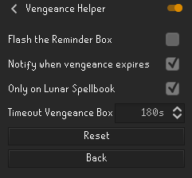
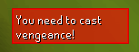

# Vengeance Helper
With the Thrall helper idea I ended up developing one for vengeance of lunar magic.

## Authors

- [@Th3mike](https://github.com/Th3mike)

## FAQ

#### How to use?

- First you will install using the runelite plugin-hub.
- After installing you will configure your vengeance helper, you should be on this screen

#### Flash the Reminder Box
- The first box works as an alert flasher, so you will see a box in the game that will flash red (if you have Photosensitive epilepsy, don't use this option).
#### Notify when vengeance expires
- The second box will send a Runelite notification, if you don't want to just turn it off.
#### Only on Lunar Spellbook
- The third box will hide the overlay when the current Spellbook is NOT Lunar.
#### Timeout Vengeance Option
- The time (in seconds) after which the overlay will hide, after the Vengeance spell is cast.

## Example

### With no flash

### With flash
